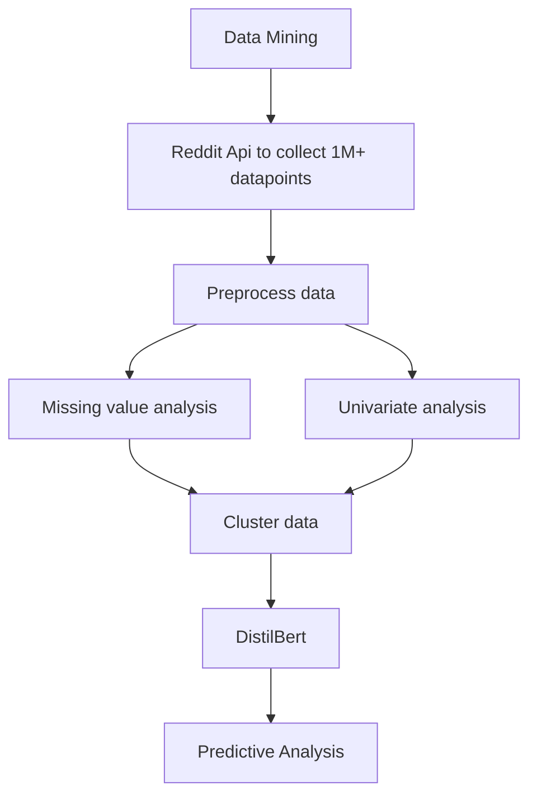

# trueUpvotes

**Keywords**: Statistical modeling, deep learning, Social Network Analysis, Reddit, Data Mining 

## Introduction
Predicting the number of upvotes a reddit post can get based on the type of post, question being submitted and the content of the post. 

 

## Analysis and Metrics:
- Scraped over 1 million posts from various subreddits using the Reddit API to create a dataset for predicting the number of upvotes based on various metrics and the structure of the posts.
- Conducted univariate analysis and treated outliers and missing values to explore the data and identify potential factors affecting collinearity in the dataset.
- Applied cluster algorithms (k-means and hierarchical clustering) to identify the most upvoted genres.
- Implemented a modified DistilBert model with a context module, n-grammar, and attention module to summarize, extract relationships, perform named entity recognition, and extract keywords from the collected dataset corpus.
- The proposed architecture achieved an\textbf{ accuracy of 96.8\%} in predicting the upvote category.

## Packages and Technologies used:

- Keras: Developing Deep Learning Models
- Tensorflow: Developing Deep learning models
- Matplotlib: Data visualization
- Pandas: Data Manipulation and organisation [Pandas](https://pandas.pydata.org/)
- Scikit-Learn: Analysis [Scikit-Learn](https://scikit-learn.org/stable/)

## Usage:
- Install the dependencies:

| Dependency      | Installation commands |
| ----------- | ----------- |
| pandas   | pip install pandas        |
| matplotlib   | pip install matplotlib        |
| Tensorflow | python3 -m pip install tensorflow |

- Using virtualenv to isolate python packages.
If you have a different version of python installed, install python 3.8

------------------------------------------------------------

Commands to set up environment - 
(make sure you are in Environments folder in terminal)- 
`pip install virtualenv`
`python -m virtualenv -p <path to python 3.8 executable> env`

------------------------------------------------------------

Use these commands to know your python executable installation location if needed - 
`import os` 
`import sys`
`os.path.dirname(sys.executable)` 

------------------------------------------------------------

Then - 
`source env/Scripts/activate #to activate the environment`

Then - 
`pip install -r requirements.txt #to install required dependencies`

------------------------------------------------------------

run command 
`deactivate`
to deactivate the environment if ever needed

------------------------------------------------------------

MAKE SURE TO UPDATE PYTHON PACKAGES DEPENDENCIES FILE WHEN YOU ADD A NEW PACKAGE using 
`pip freeze --local > requirements.txt `

------------------------------------------------------------

When setup is done and starting the project at a later time, make sure to cd into Environments folder and activate environment using- 

`source env/Scripts/activate`

- To run the code:
1. Run `python3 scraper.csv`
2. This generates the input csv (dataset), you can also use the already provided dataset
3. Run `python3 bert.py`

## Contributing
1. Fork it (<https://github.com/yourname/yourproject/fork>)
2. Create your feature branch (`git checkout -b feature/fooBar`)
3. Commit your changes (`git commit -am 'Add some fooBar'`)
4. Push to the branch (`git push origin feature/fooBar`)
5. Create a new Pull Request
